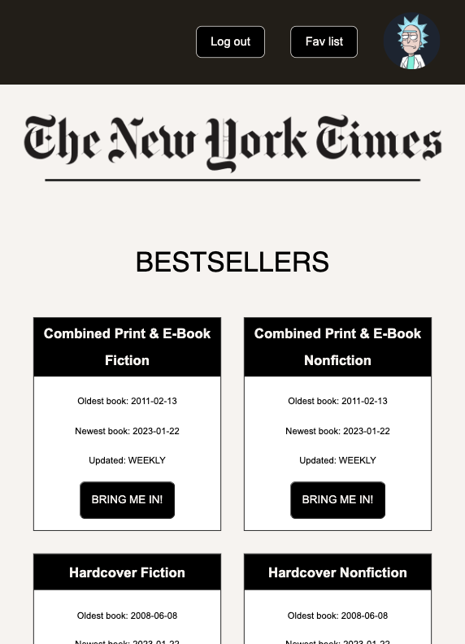
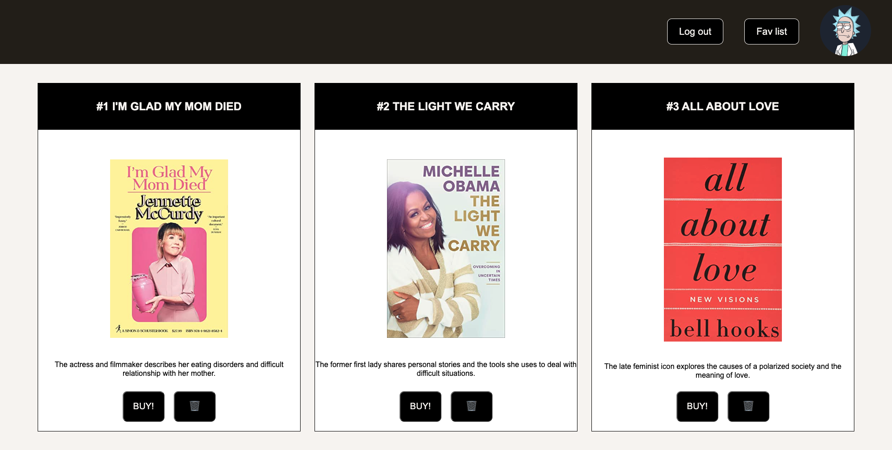
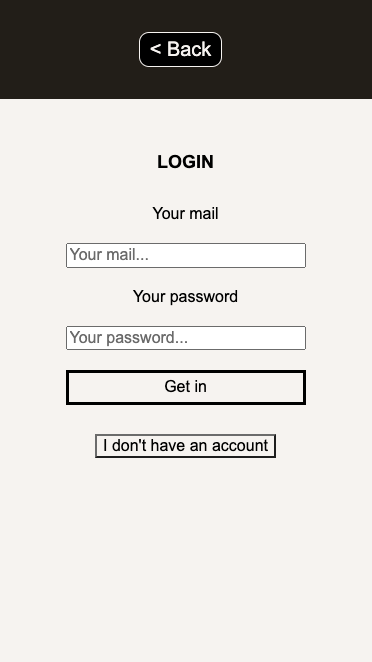
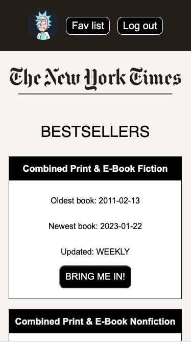

# TBProject04NYTimesLibrary

En esta web podrás acceder a las listas de libros más vendidos que están en la [API del NYTimes](https://developer.nytimes.com/apis).

### **Listas disponibles:**

La página presenta tres listas:

- Una lista con las listas ordenadas por temáticas que presentan datos como el nombre de la lista, la fecha del libro más antiguo en la lista, la fecha del último libro incluido y la frecuencia de actualización de dicho ranking. Por último un botón para que puedas cargar la lista que te interese consultar.

- Una lista con los libros ordenados por cada género. Incluyendo título, carátula, cantidad de semanas en la lista, breve descripción y un botón para poder comprar el libro. Además, si te registras, también podrás añadir cada libro a tus favoritos.

- Por último, oculta inicialmente, existe una lista de tus libros favoritos disponible si te registras como usuario. Esta lista presenta el título, la carátula, una breve descripción y dos botones: uno para comprar el libro y otro para eliminarlo de la lista.

 

  

 

 

Todas estas listas están en una única página SPA, con la que interactuar que incluye notificaciones implementadas con Toastify.

### **Autenticación:**

La página tiene un botón para acceder a otra página que te permitirá autenticarte con tu usuario y contraseña.

Si no tienes cuenta podrás registrarte desplegando un formulario de registro al pulsar el botón de debajo del login.

 

<table>
  <tr>
    <td>

</td>
    <td>
        
    </td>
  </tr>
</table>

 
Tendrás que registrar tus email, contraseña y subir una foto de perfil.

Una vez dentro, podrás navegar por las listas viendo tu foto de perfil, tu lista de favoritos y un botón para cerrar sesión en tu navegador. Podrás añadir favoritos y borrarlos.

 

[Pincha aquí para entrar a la biblioteca](https://francsy.github.io/TBProject04NYTimesLibrary/)

### **Autor:**

 

[Francisco Vicente Hernández Ramírez](https://github.com/Francsy)
